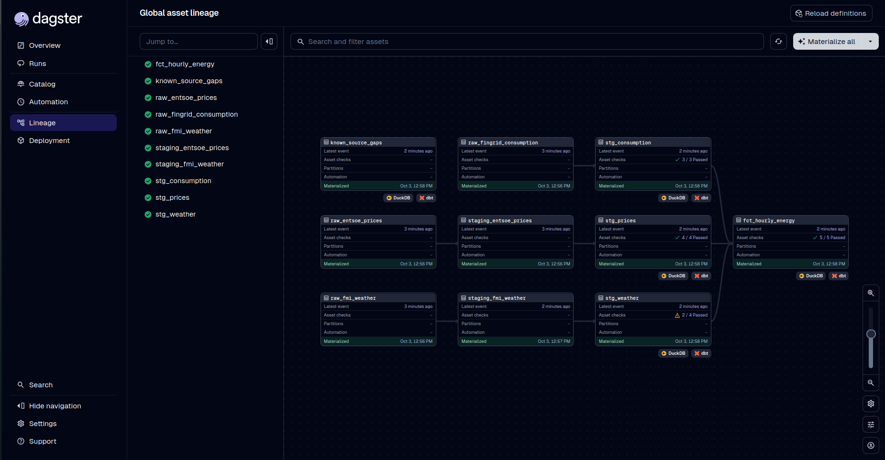
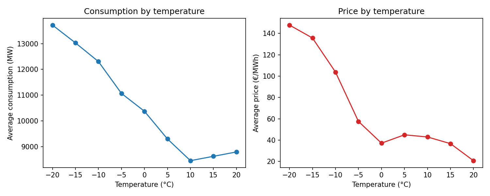
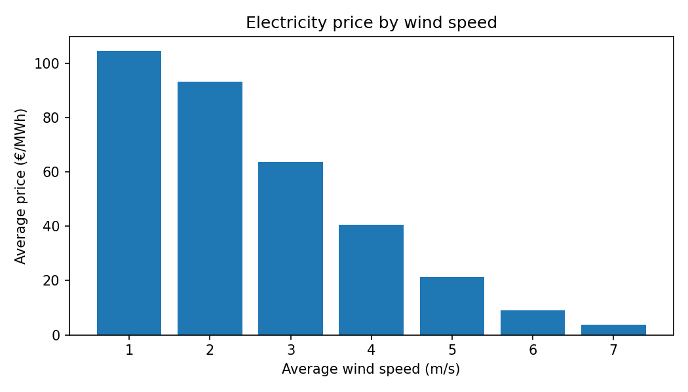

# Finnish Energy Pipeline

How do weather and electricity consumption affect electricity prices in Finland? Does cold weather make electricity more expensive, and does wind make it cheaper? This project collects the data needed to answer those questions.

This data is collected from three APIs: electricity consumption, electricity prices and weather in Finland. It cleans the data, combines it into one hourly table and runs automatically every day. Building it was also a way for me to learn data engineering steps in practice. Different concepts were explored; such as collecting data from different APIs, dealing with their different formats and time zones, and combining everything into one clean dataset that updates automatically.

## Data sources

| Source | Data | Format | Resolution |
|---|---|---|---|
| [Fingrid Open Data](https://data.fingrid.fi/en) | Electricity consumption in Finland | JSON | 15 min |
| [ENTSO-E Transparency Platform](https://transparency.entsoe.eu/) | Day-ahead prices, Finland | XML | 15 min (hourly before autumn 2025) |
| [Finnish Meteorological Institute](https://en.ilmatieteenlaitos.fi/open-data) | Temperature and wind, 6 stations | XML | 1 hour |


## Architecture

The pipeline runs in three layers. Each layer takes the data one step closer to being ready for analysis:

```
APIs -> Raw (bronze) -> Staging (silver) -> Mart (gold)
```

- **Raw (bronze):** The data from each source is saved exactly as it arrives: JSON from Fingrid, XML from ENTSO-E and FMI. Files are stored in one folder per day (e.g. `data/raw/fmi/weather/date=2026-09-28/`). I keep the raw data untouched so that if something goes wrong in a later step, I can fix it and re-run the transformations without downloading everything again. Collecting the data again can be slow and limited by API rate limits, so this saves a lot of time.

- **Staging (silver):** Here the data is converted into a clean and unified format. The XML files are parsed with Python and saved as Parquet files. Then dbt models rename the columns, set the correct data types and make sure every timestamp is in UTC and marks the start of its time period. After this step, all three sources can be joined together.

- **Mart (gold):** The final table, `fct_hourly_energy`, combines everything so that consumption, price and weather are in the same row. Since the sources have different time resolutions, the 15-minute consumption and price data is averaged to hourly values, and the weather is averaged across the six stations. One row = one hour in Finland.

The whole pipeline is orchestrated with Dagster. It runs automatically every morning, in the right order.



**Tech stack:**
- **Python**: collecting data from the APIs and parsing XML
- **Parquet**: file format for the staging layer
- **DuckDB**: the database (a single file with no server)
- **dbt**: SQL queries and data quality tests
- **Dagster**: orchestration and daily scheduling

## How I built it

1. ### Ingestion

The first phase is fetching the data using APIs. Each script in `ingestion/` gets data from a specific source using `requests` library in Python. The raw responses are saved unchanged in `data/raw/`, in one folder per day (e.g. `date=2026-09-28/`).

Each source turned out to work a bit differently. Fingrid returns only 10 records per page by default, so the script has to keep requesting the next page until there are none left. Each data source defines a "day" differently. To be more specific, FMI includes the end time in its results, so asking for 00:00 to 00:00 returned 25 hours. On the other hand, ENTSO-E returns full market days in Central European Time, which start at 22:00 or 23:00 UTC. Each script requests exactly one day at a time, adjusted to how its source counts days.

To make re-runs safe, each run overwrites the files for its day instead of adding to them. This makes the ingestion idempotent.

2. ### Parsing 
In the next phase, the raw XML from ENTSO-E and FMI is converted into Parquet files, so the data can be read as tables. The code is in `transforms/`. The XML is parsed with Python's built-in `xml.etree.ElementTree` and saved with pandas. The tags in the XML belong to namespaces, which have to be given to the parser when searching.

The two sources needed different handling. FMI returns one row per measurement (time, parameter and value), with 12 parameters per hour. This long format is kept in the staging files and pivoted into columns later in dbt. ENTSO-E prices have no timestamps at all, only a position number, so the time is calculated as `start + (position − 1) × resolution`, where the resolution is 15 or 60 minutes. ENTSO-E also leaves out a position when the price is the same as the previous one. To handle this, the parser loops over every time slot that should exist and fills skipped ones with the previous price. 

3. ### Modeling with dbt
After parsing, the data is turned into clean tables with dbt. Each model is a SQL `SELECT` query saved as its own file, and dbt builds them as tables in DuckDB, in the right order. The models are in `energy_dbt/models/`: one staging model per source in `staging/`, and the final table is in `marts/`.

The staging models only clean the data. They rename columns, set data types and make the timestamps consistent. However, combining happens later in the mart. In `stg_weather`, the long FMI data is converted into one row per station per hour, with temperature and wind as columns, using `MAX(CASE WHEN parameter = ... THEN value END)`.

Getting the timestamps right was the hardest part. The Parquet files store times labeled as UTC, but the Fingrid JSON times had no time zone at all. When joining them, DuckDB would have assumed Finnish time and matched data from the wrong hours, without any error, so I labeled everything explicitly as UTC. FMI also turned out to stamp its hourly averages at the end of the hour. So I shifted the weather data back one hour in `stg_weather`.

The final table, `fct_hourly_energy`, has one row per hour. Since the sources have different resolutions, the 15-minute consumption and prices are averaged to hours, and weather is averaged across the six stations, before joining. The result is one table where consumption, price and weather for the same hour are in the same row.

4. ### Data quality:
After building the final table, I added tests to check the completeness and correctness of the data. Each test is a query that searches for bad rows: if it finds none, the test passes. Simple tests, like checking that a column has no empty values or no duplicates, are defined in `schema.yml` files next to the models. Custom tests are SQL files in `energy_dbt/tests/`. dbt runs them all with `dbt test`, and in Dagster they run automatically after the models are built.

Deciding what should be unique depended on what one row means. Consumption and prices have one row per time slot, so `time` must be unique. Weather has one row per station per hour, so only the combination of `time` and `station` must be unique, which needed a custom test. To check that no data is missing, I add up the minutes each row covers for every day, instead of counting rows. A full UTC day is always 1440 minutes, whatever the resolution. Price days follow Central European Time, so they can also be 1380 or 1500 minutes on daylight saving days.

The tests found real problems. One weather station, Tampere Härmälä, turned out to report wind speed only as `NaN`. Instead of failing on every missing value, the final table now counts how many stations reported each hour, and a test fails only if too few did. Single missing values show up as warnings instead. The completeness test also found a few missing 15-minute slots in Fingrid's data from September 2025. Re-downloading gave the same result, so the gaps are in the source itself. These days are listed with a reason in `seeds/known_source_gaps.csv` and excluded from the test, so any new gap still makes it fail.

The result is that a passing test run actually means the data is fine. A test that always fails gets ignored, and then real problems go unnoticed, so every known failure is either fixed or documented on purpose.

5. ### Backfill:
In the previous phases, I was only using a few days of data, which was enough to build and test the pipeline but not to see any real patterns. In this phase, I downloaded 13 months of history, starting from September 2025. That range covers a full winter and summer, the daylight saving days.

I used `time.sleep()` between requests to stay within the rate limits, but Fingrid still returned `429 Too Many Requests` after a few hundred days. Its limit is one request every two seconds, and my scripts waited exactly two seconds, so small timing differences pushed some requests over the limit. To fix it, I added retries with exponential backoff: when a request fails with a temporary error (like 429 or a server error), the script waits and tries again, doubling the wait each time (5, 10, then 20 seconds). 

With 13 months of data, the tests had much more to check, and that's when they found the real problems described in the data quality phase. 

6. ### Orchestration:
In this phase, I used Dagster to automate and schedule every step. The steps include three ingestion scripts, two parsers, `dbt run` and `dbt test`. 

In Dagster, each piece of data the pipeline produces is an **asset**. Each asset shows which other assets it depends on. For example, the parsed weather data depends on the raw weather files. The assets reuse the existing ingestion and parsing functions, so no logic had to be rewritten. Dagster uses the dependencies to run everything in the right order, and shows the whole pipeline as a graph.

## What the data shows

By joining the electricity consumption, price and weather data for Finland, I investigated how these factors affect each other.

**Colder weather means higher consumption.** The colder it gets, the more electricity is used (correlation −0.86). At around −20 °C, consumption is about 60% higher than in mild weather.

**Prices rise drastically below freezing.** Between 0 and 20 °C, prices stay around 40 €/MWh, but at −20 °C they are almost four times higher.




**More wind means lower prices.** When the wind speed is high, the electricity price goes down. At 2 m/s the average price was 93 €/MWh, but at 6 m/s it was only 9 €/MWh. I assume this is because wind power is cheap to produce, so windy hours have more cheap electricity available.



Most of these results were expected. Colder weather means more demand for heating. Still, there are a few things to keep in mind. The findings are correlations, so they show which things move together, not what causes what. For example, windy days may also be milder, which lowers consumption too. Moreover, the temperature and wind are averages across six weather stations in Finland, so a smaller city counts as much as Helsinki. The wind is also measured at weather stations, not at wind farms, so it's only a rough indicator.


## How to run
1. Clone the repo and create a virtual environment: `pip install -r requirements.txt`
2. Get API keys (Fingrid, ENTSO-E) and add them to `.env`.
3. Set up `~/.dbt/profiles.yml`
```yaml
   energy_dbt:
     outputs:
       dev:
         type: duckdb
         path: /full/path/to/Finnish-energy-pipeline/data/warehouse.duckdb
     target: dev
```
4. Run: `dagster dev -m orchestration.definitions` -> Materialize all (for the last phase)


## Data attribution

Datasets were retrieved from Fingrid Open Data and the Finnish Meteorological Institute (both CC BY 4.0),
and the ENTSO-E Transparency Platform.